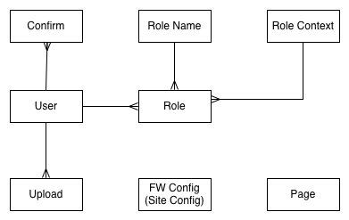

# How The Framework Works

The Framework relies on the database for many of it's operations. An Entity-Relationship diagram of The Framework is below:

To load a page, it will first check the Page table for a page which matches the URL sent to it.

The Page defines the basic permissions on the system as so:

* admin — Admin user is required
* devel — Developer is required
* mobileonly — True if the header, which key is in `Context::TOKEN` (defaults to `X-APPNAME-TOKEN`) is a JWT (JSON Web Token) and is a valid user

The Page can be of many types and this depends on what it does next:

* Template — Render the template specified
* Object — Use the specified object to handle the page
* Redirect — Tempoary redirect to somewhere else on this site
* Rehome — Permenant redirect to somewhere else on this site
* XRedirect — Tempoarily redirect to an external URL
* XRehome — Permenant redirect to an external URL

An example for a Siteaction (Object) can be found in `class/contact.php` 

By default The Framework include routes for the following:

* /about/ -> render about.twig
* /admin/ -> Built-in Admin system
* /assrts/ -> Assets system
* /confirm/ -> UserLogin confirm email address
* /contact/ -> Contact form
* /devel/ -> Developer tools
* /forgot/ -> UserLogin forgot password
* /home/ -> Render index.twig 
* /install.php -> Render oops.twig (hides installer)
* /login/ -> UserLogin
* /logout/ -> User logout
* /private/ -> Returns private file
* /register/ -> UserLogin register
* /upload/ -> Upload a file